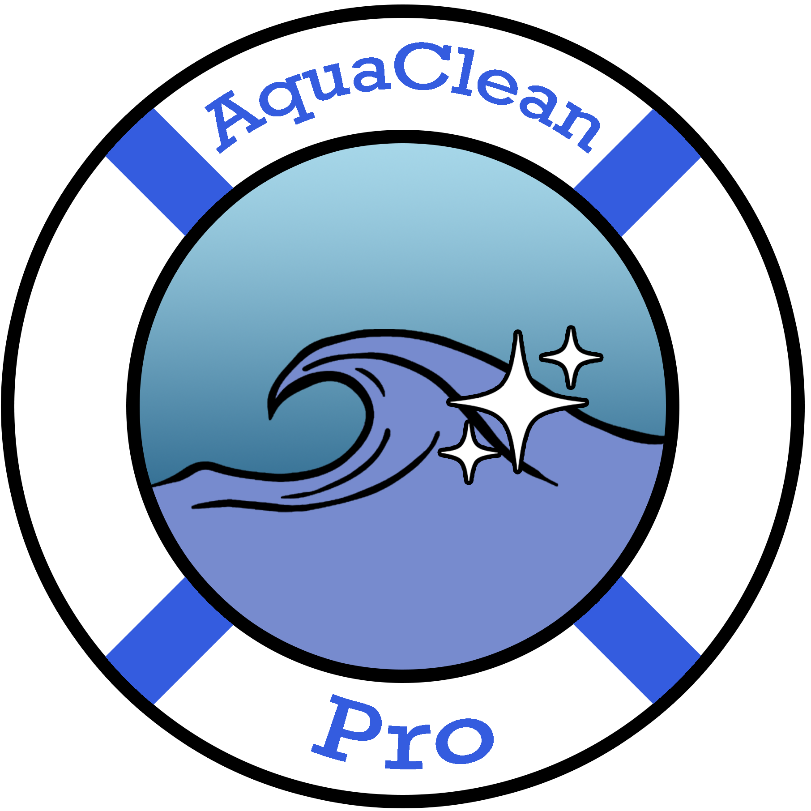

    <h1 align="center">Team AquaClean Pro</h1>

    

## Overview
This repository is for Team Projects (CEG 4980 & 4981) from Fall 2023 to Spring 2024, Team #11 - AquaClean Pro. 

### Goal
To create a robot that can autonomously clean the surface of a residential pool and determine its quality. The robot will also have a user interface that will display the metrics of water quality. 

## Custom Domain
Our project uses a custom domain of `aquacleanpro.org` hosted through Squarespace domains. The services provided by under this custom domain can be found below.

1) ### Online Document Viewer
    * The AquaClean Pro Document Viewer (ACP-DV) can be found at [https://docs.aquacleanpro.org/](https://docs.aquacleanpro.org/), which contains information about source code, meeting minutes, and other supporting documentation:
    

2) ### Grafana (Frontend)
    * Our frontend using Grafana can be found at http://www.aquacleanpro.org:8000. Login credentials required.

3) ### pgAdmin (Backend)
    * Our admin portal for Postgres for our project can be found at http://www.aquacleanpro.org:4000/. Login credentials required.

4) ### PostgREST (Backend)
    * Our backend service using PostgREST for our project can be found at http://www.aquacleanpro.org:3000/.
