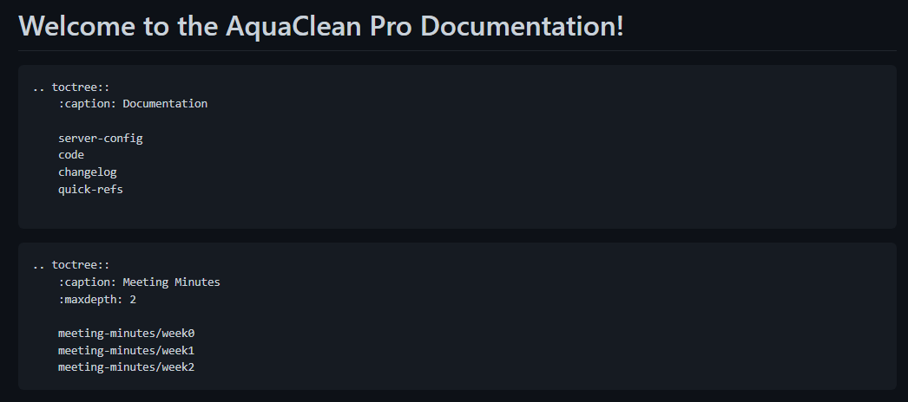
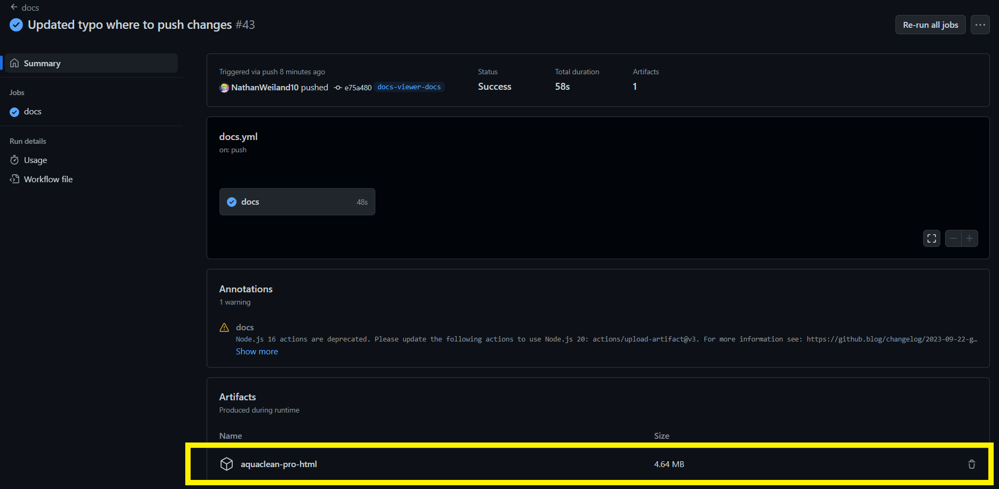
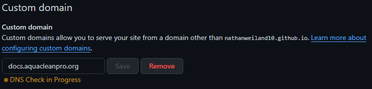

# Overview of the AquaClean Pro Document Viewer (ACP-DV)
* The ACP-DV can be found at https://nathanweiland10.github.io/AquaCleanPro/ or under the custom domain https://docs.aquacleanpro.org/.
* The ACP-DV contains source code for the AquaClean Pro, meeting minutes, and other useful links and resources regarding the development and use of the AquaClean Pro.

## Adding Files to the ACP-DV
* To add files to the ACP-DV, follow these steps:
    1) Create a new GitHub branch from the repo: https://github.com/NathanWeiland10/AquaCleanPro and create a markdown file. Typically these files should be placed in the `docs` directory.
    2) Under the `docs` directory, locate the `index.rst` file. The file should look like the following:
        * 
    3) Either add to an existing `.. toctree::` or create a new one. Creating a new `.. toctree::` with a specified caption will create a header in the ACP-DV, as shown in the following for "Documentation":
        * 
    4) Add the relative path of the markdown file under the `.. toctree::`.
    5) Upload your branch / push your changes to the GitHub repo. An automated job should be ran which will allow you to view the ACP-DV before it goes live at https://docs.aquacleanpro.org/. This can be found by clicking on the `Actions` tab, then the changes you pushed. Near the bottom you will find the local version of the ACP-DV. Extract the file and open `index.html`:
        * 
    6) Push your changes to the `main` branch after you have viewed the local version of the ACP-DV and are satisfied with the changes. An automated script will be ran to add your changes to the live ACP-DV, which can be found at https://docs.aquacleanpro.org/.

## Notes About Markdown Files in the ACP-DV
* Header levels matter in your markdown files regarding the ACP-DV. A header level of one (i.e., a single hashtag `#`) will act as a header for the name of the file. For example, in the below example, the level one header of the file will be displayed in the viewer (Ex: "Server Configuration"), **not the name of the file itself**:
    * 

## Current Issues with the ACP-DV
* When changes are pushed to the `gh-pages` branch, the custom domain of `docs.aquacleanpro.org` is reset and manually needs to be updated in the [GitHub repo](https://github.com/NathanWeiland10/AquaCleanPro) under Setting -> Pages -> Custom domain:
    * 