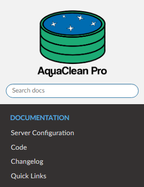

# Overview of the AquaClean Pro Document Viewer (ACP-DV)
* The ACP-DV can be found at https://nathanweiland10.github.io/AquaCleanPro/ or under the custom domain https://docs.aquacleanpro.org/.
* The ACP-DV contains source code for the AquaClean Pro, meeting minutes, and other useful links and resources regarding the development and use of the AquaClean Pro.

## Adding Files to the ACP-DV
* To add files to the ACP-DV, follow these steps:
    1) Create a markdown file and push it to the GitHub repo: https://github.com/NathanWeiland10/AquaCleanPro.
    2) Under the `docs` directory, locate the `index.rst` file. The file should look like the following:
        * 
    3) Either add to an existing `.. toctree::` or create a new one. Creating a new `.. toctree::` with a specified caption will create a header in the ACP-DV, as shown in the following for "Documentation":
        * 
    4) Add the relative path of the markdown file under the `.. toctree::`.
    5) Push your changes to the `gh-pages` branch. An automated script will be ran to add your changes to the ACP-DV.

## Notes About Markdown Files in the ACP-DV
* Header levels matter in your markdown files regarding the ACP-DV. A header level of one (i.e., a single hashtag `#`)

## Current Issues with the ACP-DV
* When changes are pushed to the `gh-pages` branch, the custom domain of `docs.aquacleanpro.org` is reset and manually needs to be updated in the [GitHub repo](https://github.com/NathanWeiland10/AquaCleanPro) under Setting -> Pages -> Custom domain:
    * 