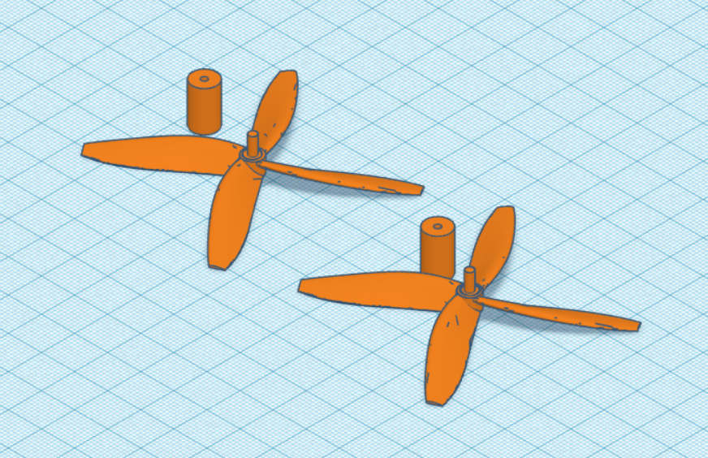
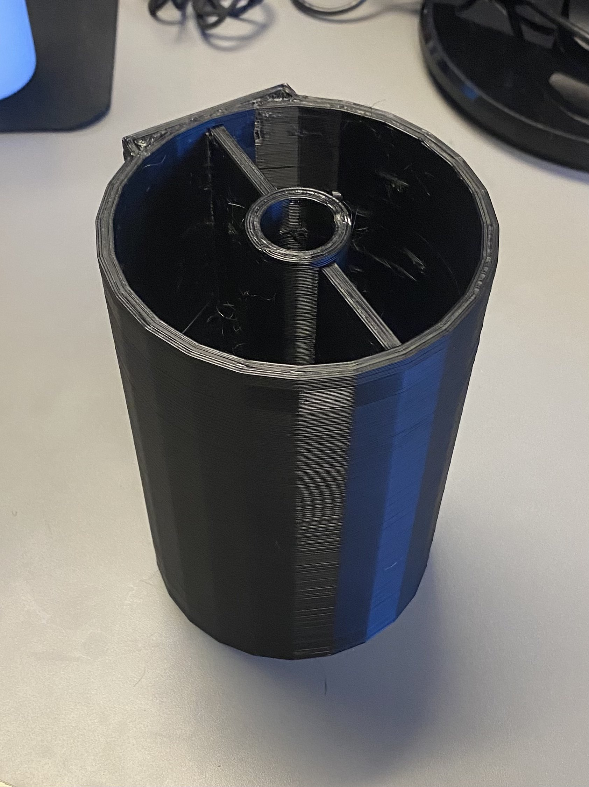

# Week 10
## Tuesday, March 19th, 2024
### Time
- 8:00am - 9:20am
### Attendees/Role
- Nathan
- Ethan T
- Ethan H
- Nermeen
- Thomas
### Decisions Made
- We created new propellers due to issues with the propellers we purchased:
    - The propellers we have do not fit well onto our motor bit
    - Issues might arise if we need to glue the propeller shaft to the motor bit, so we would need an extension of the motor shaft
- Our new propeller design addresses both of these issues and we have the ability to adjust the model as needed due to excess filament
    - 
- Ethan T printed the first segment for the AquaClean Pro
    - 
- Ethan T calibrated the pH sensor to get the correct values for the pH offset (526.035) and curve (143.133)
### Questions or Concerns
- N/A