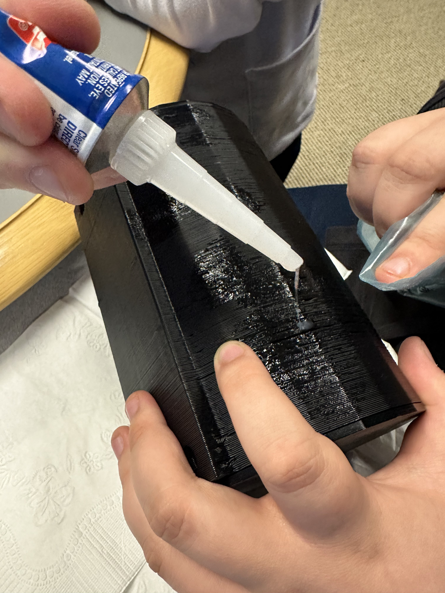

# Week 11
## Thursday, March 28th, 2024
### Time
- 8:00am - 9:20am
### Attendees/Role
- Nathan
- Ethan T
- Nermeen
- Thomas
### Decisions Made
- Nermeen began work on wiring all of our electrical components together
- Ethan T finished and brought in the full 3D printed model
- Nathan and Thomas began sealing the cracks on the outside of the 3D model pieces to ensure that the design is waterproof
    - 
### Questions or Concerns
- Still waiting for a response from Billy Willis about using the WSU swimming pool for running our tests
    - Possible backup: Buy a small swimming pool from Meijer to test in