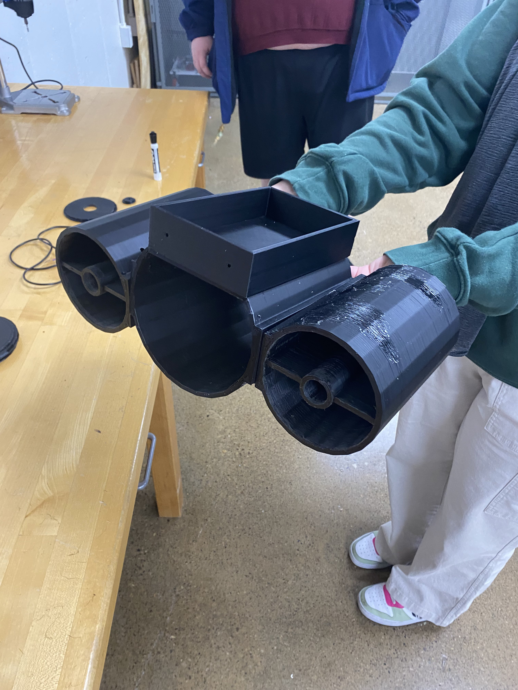

# Week 12
## Tuesday, April 2nd, 2024
### Time
- 8:00am - 9:20am
### Attendees/Role
- Nathan
- Ethan T
- Ethan H
- Nermeen
- Thomas
### Decisions Made
- Ethan T began sanding down the design to ensure a better fit among the different pieces.
- Ethan T, Nermeen, and Nathan also started constructing the whole craft by putting together all the sealed pieces.
- Thomas, Nathan, and Ethan T started sealing up the holes in the craft with the sealant and stuck the various parts of the print together to make the final craft.
- Nermeen and Nathan started assembling the electrical components in the waterproof box to get wires through.
    - 
- Ethan H is running into issues with the decryption pipeline, currently attempting some fixes to locate where the issue is and fix it before testing next week.
### Questions or Concerns
- From discussing with another group, renting the pool for testing can cost up to $20 an hour
    - To do this, we will also need to fill out a form, which can be found [here](https://www.wright.edu/sites/www.wright.edu/files/page/attachments/facility-request-form_0.pdf)