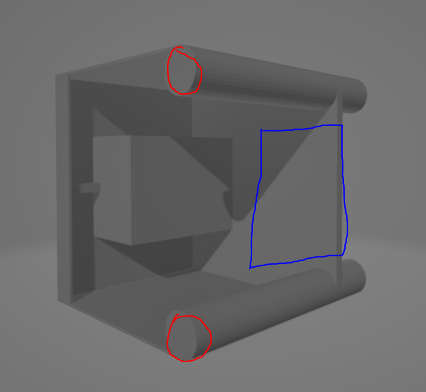

# Week 4
## Tuesday, February 6, 2024
### Time
- 8:30am - 9:20am
### Attendees/Role
- Nathan
- Ethan T
- Ethan H
- Nermeen
- Thomas
### Decisions Made
- Update the 3D model:
    - Removing a section of the back wall and replacing it with L-shaped channels for wiring (removing the blue square area). This will allow for extra room for netting and to reduce drag in the water.
    - Adding counterweight for motors by filling in the front portions of the ballasts of where our motors will be (the red circles).
    
- Possibility of adding cosmetics or decorations after printing as time allows.
- Meeting at Joshi 367 on Tuesdays, and meeting on Thursdays at Joshi 367 if needed
### Questions or Concerns
- Talk to Billy about finding where our parts are. We checked the basement of Russ and they were not there.