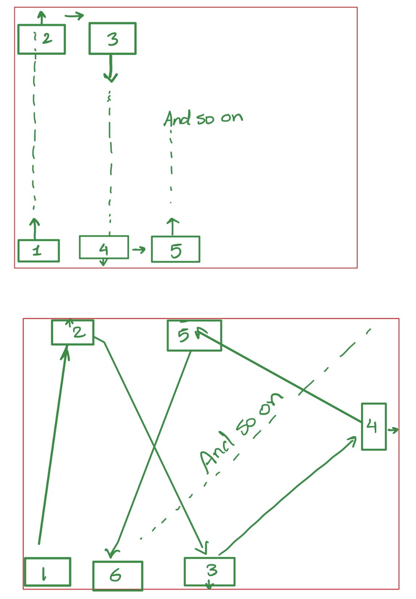

# Week 5
## Tuesday, February 13, 2024
### Time
- 8:30am - 9:20am
### Attendees/Role
- Nathan
- Ethan T
- Ethan H
- Nermeen
- Thomas
### Decisions Made
- Movement controls using the distance sensor; two possible options
    - 1: Start the bot in a corner and have it move straight until it reaches the next corner. Rotate the bot 90 degrees, move forward a small amount, rotate another 90 degrees, then move forward until it reaches a wall. Continue this until the bot reaches a corner. This could potentially still work if the bot is not placed directly in the corner
        - 
        - 
        - 
    - 2: Have the bot move forward from anywhere starting in the pool. Once the bot reaches a wall, have the bot rotate until it no longer is within a certain range of the wall, rotate a certain number of additional degrees (value can be tweaked later), and move forward. Continue this process.
        - 
    - Both designs
    - 
 - <b>Action Items:</b>
    - Nermeen: Distance sensor coding (using personal ESP)
    - Ethan T: pH sensor coding (using personal ESP)
    - Ethan H: Focusing on PostgREST
    - Nathan: Motor coding (using Tinkercad with an Arduino)
    - Thomas: Temperature sensor coding (using Wokwi emulator - DS18B20)
### Questions or Concerns
- Drilling holes into the waterproof box to allow the wiring to go through
    - We will manually drill holes into the box rather than using the sealing nuts so it will fit the design we have created. The only external wiring would be for the two motors and the distance sensor. We can waterproof by using the sealant we have.
- The motors we got did not come with wires, but we have ones we can use.