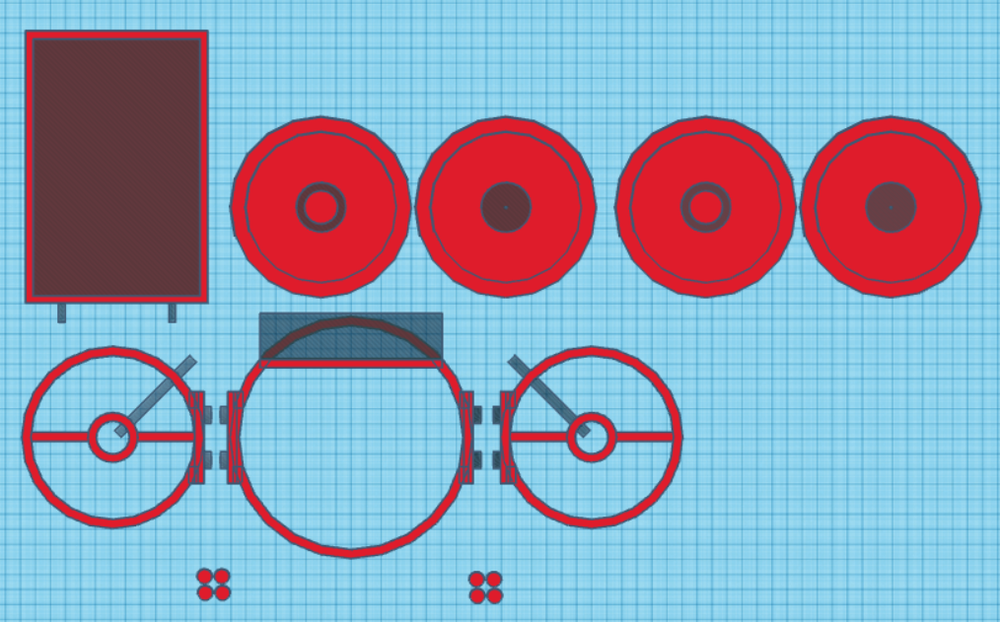
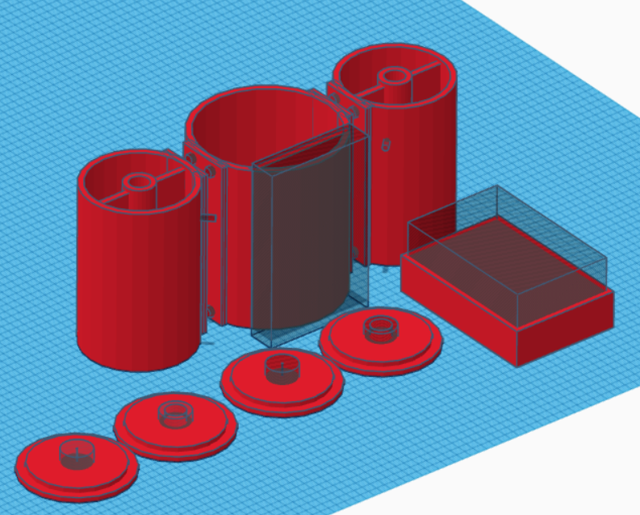

# Week 9
## Thursday, March 14th, 2024
### Time
- 8:30am - 9:20am
### Attendees/Role
- Nathan
- Ethan T
- Ethan H
- Nermeen
- Thomas
### Decisions Made
- We tested our pH sensor and was able to correctly read in values. A calibration testing kit has purchased by Ethan T so that we can ensure the values read in are correct
- We decided to update the 3D model for the AquaClean Pro. Tinkercad was used for the software since it was simpler to use and allowed us all to view and make changes to the model at the same time. The new model also addresses some of the issues we found with the previous model, such as the buoyancy and balance of the model, pathing of the wires from the water-proof box to the motors, and potential issues when printing the model (such as needing supports)
    - 
    - 
- We are hoping to have the 3D model completed and printed by next week so that we can begin integrating our components
### Questions or Concerns
- N/A